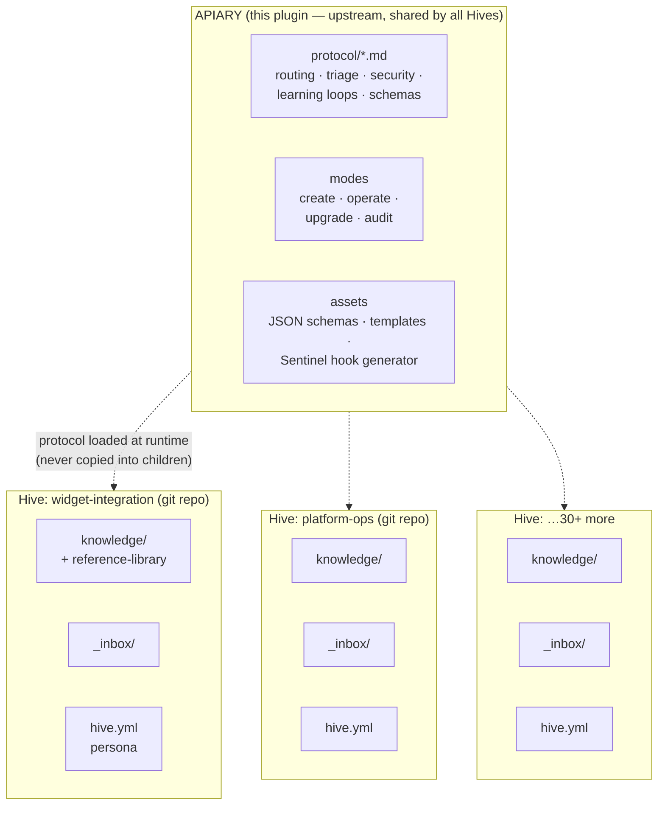
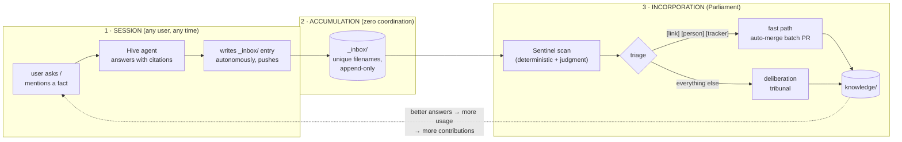
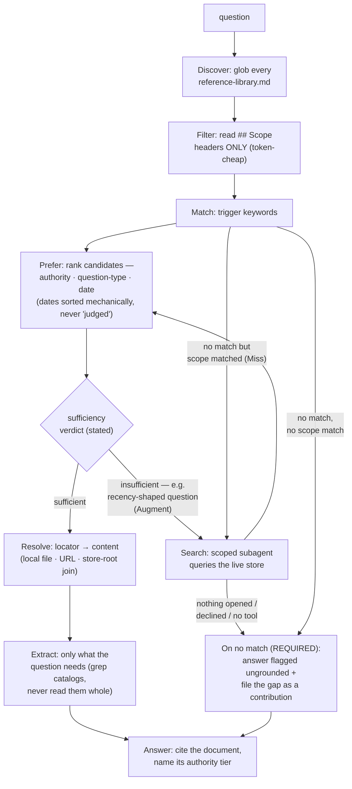

# Apiary — the Hive Parent Protocol

**A governed, multi-contributor knowledge base that an AI agent operates — backed by nothing but a git repo, markdown, and bash.**

One upstream plugin (this one — the **Apiary**) carries the entire operating protocol. Any number of child repos (**Hives**) carry only their domain knowledge. Thirty-plus teams can each run their own Hive, and a routing improvement, security pattern, or triage fix lands upstream **once** and reaches every Hive on its next session — no vendoring, no sync scripts, no forks.

```
# Install                          # Use
claude plugin install apiary@ahartzog
/apiary create        # scaffold a new Hive
/your-hive            # talk to an existing one (its thin skill delegates here)
/apiary parliament    # incorporate accumulated contributions
/apiary audit         # health check
```

> **Reading guide.** New to this? Read the next three sections — they're the whole idea. Building on it, or you're an LLM operating a Hive? Jump to [The Protocol Contract](#the-protocol-contract-for-llms-and-protocol-authors). Debating where decisions happen? [Where Decisions Actually Get Made](#where-decisions-actually-get-made) is the map.

---

## The idea in one story

Your team's knowledge lives in twelve heads, four wikis, and a SharePoint nobody trawls. A new engineer asks "how does flight dynamics hand off to T&C?" and the answer is a shrug plus a link to a stale page.

A **Hive** fixes this with three moves:

1. **Anyone talks to the Hive's agent; the agent answers only from curated, cited knowledge** — and when it can't, it says so *and files the gap against itself* so the miss is repaired instead of repeated.
2. **Everything anyone learns gets captured for free.** During any session, new facts are appended to an inbox — no forms, no permission, no PR to write. Capture costs the contributor nothing, which is the only price at which capture actually happens.
3. **Nothing enters the shared knowledge without review.** A tribunal of AI agents (**Parliament**) triages the inbox: trivially-safe additions merge automatically; anything that modifies, contradicts, or opines goes through adversarial critics and a verdict — with humans holding the gates that matter.

Capture is frictionless, curation is ruthless, and the two never share a gate. That separation is the whole design.

## The architecture



Three layers, strictly separated:

| Layer | Owns | Changes via |
|---|---|---|
| **Apiary** (upstream) | All mechanics: routing protocol, Parliament, Sentinel, triage rules, schemas, audit | PR to this plugin — one change reaches every Hive |
| **hive.yml** | A Hive's identity: slug, remote, codeowners, extensions | The Hive's codeowners |
| **Content** | Domain knowledge, persona, inbox, sources | The three-phase loop below |

Two properties make the upstream model safe:

- **Extensions are additive-only, structurally.** A Hive can add workflows, schema fields, triage categories, and pre-push gates — but a gate is *compiled in after* the Sentinel scan and its failure is terminal before any gate runs, so no child configuration can weaken an upstream control. A Hive can only raise its own bar.
- **Protocol ships by reference, never by copy.** The lesson that forced this: an earlier version copied the routing protocol into each Hive at create time, and it drifted into 3-step, 6-step, and 7-step variants in production. Protocol that ships by copy is protocol that forks.

## The three-phase loop



The contributor experience: *you talk to the agent; everything else is invisible until it needs a human.* Sessions never write `knowledge/` — a protocol invariant reinforced by tooling: the settings template pre-approves only `_inbox/`/`sources/` staging, and `knowledge/` changes arrive via Parliament PRs (or human direct-PRs), codeowner-gated wherever branch protection is configured.

**Where the inbox rides is configurable** (`hive.yml.inbox_transport`), and new Hives default to the **queue-branch transport**: sessions push to a dedicated, never-PR-gated queue branch, Parliament is the only bridge, and processed entries are drained from the queue after their attribution is preserved in `_inbox/_completed/`. That lets the default branch carry full vanilla protection — required PR + codeowner review on *everything*, no bots — while capture friction stays identical (one direct push): unreviewed content never enters default-branch history, and queue history can be cheaply rewritten for incident response. The legacy `default-branch` transport (inbox commits pushed straight to the default branch) remains available, and is what an absent field means — existing Hives never change transports without an explicit `hive.yml` edit; audit offers the migration. Design and migration: `skills/apiary/references/inbox-transport-design.md`.

## How a question finds its answer (the RLDP)

Retrieval is **LLM-navigated indexes over grep** — no embeddings, no vector DB, by design (contributors need nothing beyond git; and 2025-26 research has since validated plain-index navigation as the *better-performing* choice at this scale, not just the cheaper one). The Reference Library Discovery Protocol (`protocol/routing-protocol.md`) is the canonical spec; this is its shape:



Two ideas here are unusual and load-bearing:

- **A miss is a contribution.** `§On no match` makes gap-recording a *hard completion gate*: a question the index can't route becomes an inbox entry naming the gap. The routing index is repaired by its own failures.
- **The corpus is never assumed complete.** A catalog of an external store is a point-in-time view of something that keeps being written to — so a routing *hit* doesn't end the protocol; a sufficiency test does, and a recency-shaped question can dispatch a live, scoped store search whose discoveries are promoted (only if actually opened) into the catalog for every future session.

## Where decisions actually get made

The question every governed-knowledge system must answer: *who decides, who deconflicts, who resolves?* Apiary's answer is a **ladder of escalating authority** — evidence rules first, tribunal verdicts second, humans last and least often, with every decision recorded where the next reader will find it.

| Decision | Made by | Mechanism | Recorded as |
|---|---|---|---|
| Which source answers a question | Session agent | §Prefer: authority tier (`formal>baseline>delivered>working`) + question type + mechanical date sort | citation + authority named in the answer |
| Is the corpus sufficient | Session agent | §Sufficiency test (verdict stated in-transcript) | `sufficiency:` line |
| What enters the inbox | **Nobody** — capture is ungated | append-only, autonomous | attributed, timestamped entry |
| Is a contribution safe | Sentinel (deterministic scan + rules) | credential/PII patterns + any Hive-declared gate extension; **cannot be disabled by anyone** | quarantine + report |
| Is a contribution true/placed/formatted | Three parallel critics (Skeptic·Archivist·Cartographer), no cross-talk | independent PASS/FAIL checklists | checklists in the PR |
| Does it merge | **Chancellor** (verdict: MERGE/REVISE/REJECT/ESCALATE) | weighs critics; verifies directly on critic deadlock | verdict + reasoning in the PR |
| Conflicting facts over time | **Loop D** | 2nd challenge in 30 days → fact marked `[disputed:]`, humans summoned | `[disputed:]` annotation + needs-review PR |
| Anything an agent chose autonomously | Humans, eventually | `[decided: claude, date]` marks agent forks; audit surfaces unratified ones | `[decided:]` annotations |
| Protocol itself, escalations, disputes, `[meta]` | **Humans (codeowners)** — always | CODEOWNER-gated PRs; `[meta]` reaches humans regardless of verdict | PR review record |

Three principles under the table: **facts are never deleted, they're superseded** (`[superseded:]` keeps the losing fact visible under its marker — history is the audit trail); **disagreement is data** (a contradiction doesn't overwrite — it accumulates until velocity triggers escalation); and **agents propose, structure disposes** — no single agent, including the Chancellor, can put content into `knowledge/` outside a PR whose gates are set by humans.

---

## The Protocol Contract (for LLMs and protocol authors)

Dense summary. The files are canonical; this is the map.

**Invariants (hold every session, no file read needed):** every correction and reusable artifact becomes an inbox contribution before session end · cite knowledge sources · sessions never write `knowledge/` or `PROTOCOL/` · Sentinel cannot be disabled.

**File map:**

| Surface | File | Contract |
|---|---|---|
| Mode router | `skills/apiary/SKILL.md` | thin dispatch: create/operate/upgrade/audit; ≤150 lines by rule |
| Runtime | `references/mode-operate.md` | Step 0 one-call startup (clone/sync/hook/identity), lazy protocol table, push discipline |
| Routing | `protocol/routing-protocol.md` | the RLDP: 10 named steps (§Discover→§Answer); cite steps by name, never number |
| Retrieval metadata | `protocol/document-quality.md` | `doc_type`/`authority`/`covers`; trawling gates; question-type routing |
| Schema | `protocol/knowledge-schema.md` + `assets/*.schema.json` | frontmatter contract; inline annotations `[learned:] [decided:] [superseded:] [disputed:]`; store roots for catalogs |
| Triage | `protocol/triage-policy.md` | tag→path table; § Write Operations (ADD/SUPERSEDE/ANNOTATE — no DELETE); canonical MERGE disposition defers to custodian §4.3 |
| Parliament | `protocol/custodian-workflow.md` | Sentinel §0 (deterministic scan is a literal command) → normalize → Archivist → critics ∥ → Reviser → Chancellor → PRs → telemetry §6.2 |
| Security | `protocol/security-policy.md` + `protocol/sensitive-data-patterns.md` + `assets/generate-hook.sh` | layers L0 pre-push hook / L1 session redaction / L3 Parliament (numbering is historical — a former L2 server-side pre-receive hook was retired); patterns JSON compiles into the hook; excerpt-bound overrides |
| Learning | `protocol/learning-loops.md` | A Correction, B Discovery (capture+findability are ONE obligation), C Calibration, D Escalation; A/B fire in-session, C/D in Parliament |
| Search | `protocol/external-search-agent.md` | §Search subagent contract: reads to dedup, writes nothing, returns catalog-shaped rows, never citable prose |
| Sources | `protocol/sources-policy.md` | verbatim primary material; Sentinel-gated, Parliament-bypassing; indexed or it didn't happen (Goal 9) |
| Tests | `skills/apiary/tests/` | 7 bash suites + `tests/golden/cases.md` — behavioral cases pinning RIGHT/WRONG with the governing protocol clause cited |

**Design goals that adjudicate disputes** (`protocol/design-goals.md` + repo `DESIGN-GOALS.md`): reference-don't-duplicate (the index is the product, so retrieval is an obligation, not a fallback) · progressive discovery · additive-only extensions · Sentinel non-negotiable · contribution flywheel (friction at capture kills everything downstream) · size budgets · temporal annotations on every fact · upstream governance · discoverability guarantee (every surface names its index, write path, and audit check — or it doesn't ship) · operating instructions carry no state or history.

**Authoring rules an LLM editing this repo must follow:** run the 7 test suites before any PR (`CLAUDE.md`); routing-file changes additionally run the golden behavioral half; every mechanical change passes the three CONTRIBUTING scenarios; cite protocol sections by §name; put rationale in `references/*-design.md`, never in hot-path files; state a Design-Goals compliance section in the PR.

---

## Operator Reference — Standing Up a New Hive's Backing Store

> §2 below illustrates codeowners enforcement using GitHub Enterprise (GHE) as the example git host — adapt the platform-specific mechanics to whatever git host you use. The sequence and gotchas are the transferable part.

`/apiary create` scaffolds all of a Hive's *files* (hive.yml, PROTOCOL, knowledge/, etc.) locally, but it does **not** create the repo on your git host that those files get pushed to, or configure repo-level access control. Those are one-time, human/repo-admin steps that must happen **before or immediately after** `/apiary create` — agents should walk the user through them explicitly rather than assuming they're already done. This section is the checklist for both.

### 1. Create the repo on your git host

Create an empty repo on your git host and note its clone URL — the exact provisioning process (self-service "New repository," a request to a platform team, an internal automation) varies by org, so follow whatever process yours uses.

Once the repo exists, run `/apiary create`, answer the interview (Q5.25 asks for exactly this repo's git remote URL), and push the generated scaffold to it.

### 2. Set codeowners correctly

`hive.yml.codeowners` (Q4 of the create interview) must actually match who can approve merges on the repo — the Apiary only writes the *intent*, it doesn't wire up host-side enforcement:

- **`push_mode: direct` (default):** no repo-side gating is required — the session agent pushes straight to the default branch. Still keep `hive.yml.codeowners` accurate; it's who Parliament tags for escalations and quarantine review (see `protocol/triage-policy.md`).
- **`push_mode: pr`** (required once the default branch has required status checks or policy-bot): codeowners enforcement moves to `.policy.yml` + a narrowed `CODEOWNERS` file, *not* GHE's native all-or-nothing CODEOWNERS check. Follow `skills/apiary/references/push-mode-pr-setup.md` § One-Time Operator Setup end-to-end — it covers enabling auto-merge, the required CI checks, the policy-bot rules that let `_inbox/**` auto-merge while `knowledge/**` stays gated on a codeowner, and the `CODEOWNERS` narrowing that's easy to miss (`_inbox/` must be listed with a blank owner list, or the native GHE check still blocks inbox-only PRs).
- For a first rollout on sensitive content (e.g. a Hive with a strict sensitivity gate extension), consider requiring codeowner review on *every* PR — including inbox-only ones — as a deliberate trial period, until you've built confidence in Sentinel + Parliament. Loosen to the standard inbox-auto-merge split once that confidence exists; document the trial period and its exit criteria in the Hive's own README.

### Order of operations, end to end

1. Create an empty repo on your git host, note its clone URL, and set it as `hive.yml.remote`.
2. `/apiary create` → answer the interview → push the generated scaffold to that repo.
3. If using `push_mode: pr`, complete the one-time policy-bot / auto-merge / CODEOWNERS setup in `push-mode-pr-setup.md` before flipping the mode on.
4. Make the generated child skill (`assets/child-skill-template.md` output — see Create mode Step 2) callable: the simplest path is creating `~/.claude/skills/your-hive-slug/SKILL.md` with the generated file's contents in your personal skills directory, which makes `/your-hive-slug` available starting your next Claude Code session. Publishing it via a plugin marketplace is the optional path for sharing it with a team.
