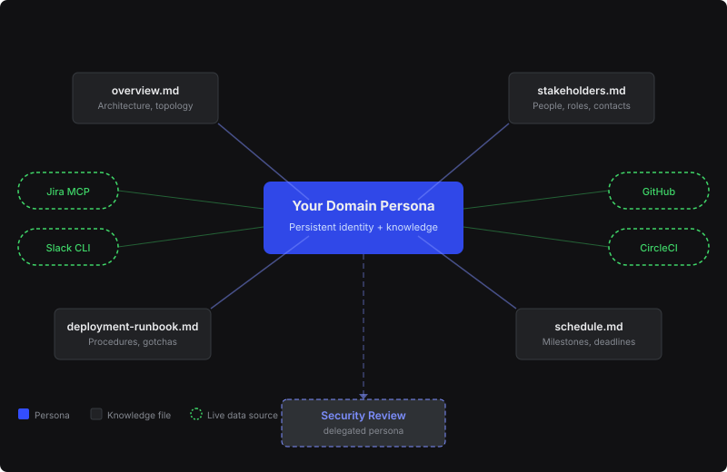
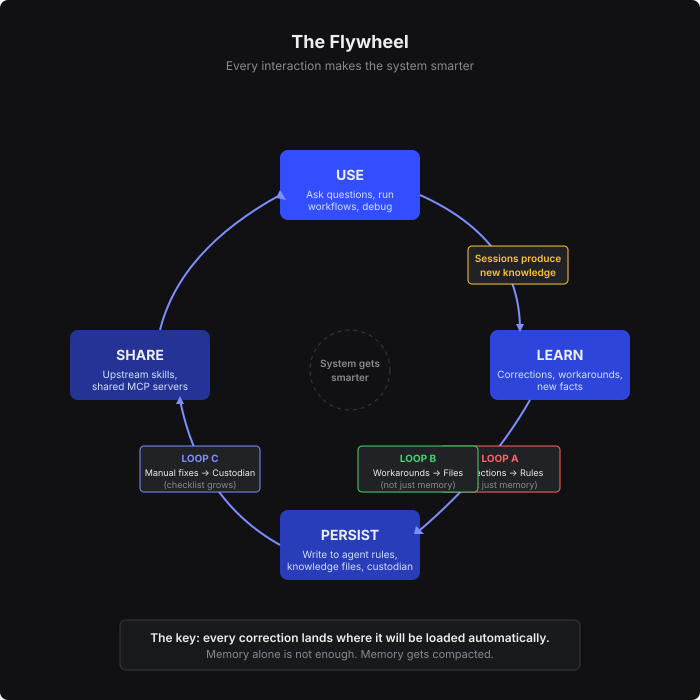

# second-brain

**Stop re-explaining your life to Claude every session. Build domain experts that remember — and get smarter every time you use them.**

A meta-skill for the full lifecycle of domain agents with persistent markdown knowledge bases: **create** new agents, **adopt** hand-rolled ones, **audit** health, **improve** against gold-standard patterns, and **add workflows**. It's built around five reinforcement loops, adopt mode, golden-question evals, and hook-based enforcement.

## The Problem

Every session starts from zero. Your AI assistant has amnesia: the budget thresholds you tuned, the medical context that matters, the contractor red-flags you learned the hard way — all gone when the window closes. Corrections evaporate. Workarounds get rediscovered. The same mistake happens three sessions in a row.

## The Solution

A **domain agent** is a persistent AI identity scoped to an area of your life — finances, household, family, health. Its knowledge lives in plain markdown next to it. A **hub CLAUDE.md** routes questions to the right agent; the discipline that makes the whole thing compound lives in this skill and is loaded by every agent at session start (operate mode).

The value isn't the setup — it's the **flywheel**: every session produces knowledge, knowledge gets persisted where future sessions will load it automatically, better sessions produce better knowledge.



---

## Under the Hood: The Techniques

The Second Brain is a bundle of knowledge-management techniques that work in any directory with plain markdown. None of them require a database, embeddings, or a specific note-taking app. This is the part that makes it a reusable knowledge-base system rather than a one-off set of agents.

### 1. The knowledge base is an *index*, not a store

The Second Brain is a **navigation layer**. Its job is to route a question to the right source in seconds — not to hold copies of the answers. Each layer is deliberately more compact than the one below it, so the agent loads pointers, then loads content only on demand:

| Layer | Size budget | Job |
|---|---|---|
| Hub `CLAUDE.md` | < 200 lines | Route to the correct domain |
| Agent file | < 300 lines | Scope, routing, modes, principles |
| Knowledge file | < 200 lines each | Curated facts + pointers to sources |
| Vault / source content | no limit | Full documents, read on demand |

Retrieval runs through **three index layers, each with one job**: the hub lists agents; each domain's `index.md` lists that folder's files; each domain's `reference-library.md` maps *questions* to *files* using **retrieval triggers**:

```markdown
| Topic | Source | Triggers |
|---|---|---|
| Equity & option exercises | `Financial/equity.md` § ISO exercise strategy | ISO, RSU, exercise, AMT, 409A, FMV, vesting, tender |
```

A `reference-library` is a **routing index, not a content store** — it tells the agent *which file to load* for a phrase, never reproduces the fact. Agents discover these libraries automatically and read only the `## Scope` header when filtering for relevance. If a knowledge file grows past ~200 lines, it has stopped being an index and become a content dump — the fix is to extract the content to its natural home and leave a pointer. **Reference, never duplicate**: point to the live project board, the shared wiki page, the bank statement — the source of truth is always the live system, so a copy is stale the moment you paste it.

### 2. Every fact carries metadata (the schema)

Every knowledge file opens with YAML frontmatter conforming to a canonical schema ([`protocol/knowledge-schema.md`](skills/second-brain/protocol/knowledge-schema.md)). This is what makes staleness, quality, and routing *mechanical* instead of vibes:

```yaml
---
domain: financial
type: status          # reference | register | status | index | reference-library
description: Current benefits elections, balances, and use-it-or-lose-it deadlines
decay: fast           # fast (14d) | medium (60d) | slow (180d)
confidence: high      # high | medium | low
last_updated: 2026-07-01
review_by: 2026-12-01
sources:
  - { doc: "Fidelity NetBenefits", url: "https://..." }
---
```

- **`type`** tells the agent how to route and how fast to distrust the file. A `status` file (sprint state, balances) is treated as perishable; a `reference` file (architecture, mission) is treated as durable.
- **`decay`** sets the staleness clock. `fast` = flag after 14 days, `medium` = 60, `slow` = 180. Decay is **domain-differentiated on purpose** — balances go stale in weeks, birthdays never. Uniform review cadences are the number-one cause of wasted review cycles.
- **`confidence`** changes agent *behavior*. `high` = verified against a primary source; `medium` = credible but second-hand; `low` = inferred or estimated. When generating anything outward-facing or high-stakes, the agent caveats or omits `confidence: low` entries automatically.

### 3. Two kinds of staleness — and both are detected

Most systems only track one. The Second Brain separates them because they fail differently:

- **Knowledge decay** — *the fact got old.* Caught by the `decay` clock and `[review-by:]` dates. The audit flags any file whose `last_updated` has blown past its decay threshold.
- **Sync drift** — *the source changed and the knowledge file didn't.* Caught by `.staleness-manifest.json`, a cache at the hub root that fingerprints every `sources:` target (file count, mtime, ticket count, page version). Each audit re-fingerprints and, if the source moved but the knowledge file's `last_updated` didn't, flags the file as **sync-stale**.

Together they catch both "this is old" and "the world moved and nobody told us."

### 4. Inline provenance annotations

Metadata lives at the file level; provenance lives inline, on individual facts:

| Annotation | Purpose |
|---|---|
| `[learned: YYYY-MM-DD]` | When the fact entered the system (required on every new fact) |
| `[review-by: YYYY-MM-DD]` | When to re-verify (required for fast-decay facts) |
| `[superseded: YYYY-MM-DD, reason]` | Marks a replaced value — **facts are never silently overwritten** |
| `[disputed: YYYY-MM-DD]` | Two sources disagree; both are surfaced, not buried |
| `[confidence: low]` | Inline flag for an unverified high-stakes claim |

```markdown
- Ship date: Jul 15 (hard deadline) [learned: 2026-03-15] [review-by: 2026-05-01]
- Primary care physician: Dr. Alvarez [learned: 2026-03-30]
- Primary care physician: Dr. Chen [superseded: 2026-03-30, replaced by Dr. Alvarez]
```

### 5. Three-tier memory taxonomy

Different knowledge ages differently, so it lives in different places:

- **Procedural** = the agent file. How to behave, what to delegate. Changes rarely.
- **Semantic** = knowledge files. Facts about people, systems, processes. Changes as the domain evolves.
- **Episodic** = lessons-learned, decision records, post-mortems. Grows over time, rarely revised.

### 6. Document taxonomy for external catalogs

When an agent catalogs a document store (SharePoint, Confluence, vendor deliverables), each entry carries `doc_type` (what kind of document) and `authority` (`formal` / `baseline` / `delivered` / `working` — how much citation trust it earns). The agent routes "what are the requirements?" to `formal` sources and caveats anything `working`. See [`references/document-quality.md`](skills/second-brain/references/document-quality.md).

### Why not just use Claude Code memory?

Because memory is the audit trail, not the enforcement point. Memory gets **compacted** — a nuanced behavioral correction becomes a one-line summary that loses the *why*. Memory isn't scoped to agents — a correction about the financial agent sits in a global file the medical session never loads. And nothing checks that a correction ever reached the agent it was about.

The Second Brain **dual-writes**: every correction goes to memory (history) *and* to the place it will actually be enforced (agent rules, knowledge files, custodian checks). The agent's own files become the enforcement point. That's the difference between a knowledge base that decays and one that compounds.

---

## The Five Learning Loops

Persistence alone isn't enough — a static knowledge base still rots. Five closed feedback loops turn each session's byproducts into permanent, auto-loaded state:

| Loop | Circuit | One-liner |
|------|---------|-----------|
| **A** | Corrections → agent rules | "You told me I was wrong. I won't do that again." |
| **B** | Discoveries → knowledge files | "We found something. It's written down forever." |
| **C** | Quality catches → custodian checklist | "You caught it manually. Next time it's automatic." |
| **D** | Contradictions → disputed flags | "Two sources disagree. Surface it, don't bury it." |
| **E** | Process retrospection → agent definitions | "My own instructions failed me. Fix the instrument." |

All five share one principle: **the lesson must land where it will be loaded and enforced automatically in future sessions.** Memory alone is not enough — memory gets compacted.

Loop E is this skill's signature addition: agents proactively review their own instructions at every task-completion gate (Did I work around my own rules? Did the user correct my approach, not just facts?) and propose revisions — with an eviction discipline, so dead rules get removed instead of accumulating.

### Where the loops live

The loops, triage policy, and knowledge schema are **single-sourced in this skill** and loaded at session start via operate mode ([`references/mode-operate.md`](skills/second-brain/references/mode-operate.md)) — never copied into hubs. A restated copy freezes the day it's written: that's how a hub ends up faithfully running a four-loop protocol with no process retrospection long after Loop E shipped, while looking perfectly healthy. Behavioral rules live in the agent definition, because reading the agent file *is* invocation — there is no session with the agent that doesn't load them. The hub `CLAUDE.md` keeps what is genuinely local: the routing table, shared context, and ambient guardrails.



## Modes

```
/second-brain operate       # Load the universal operating protocol — the enforcement path every domain agent bootstraps
/second-brain create        # Interview → scaffolded agent + knowledge files + hub wiring
/second-brain adopt         # Bring existing hand-rolled agents under management (voice-preserving)
/second-brain audit         # Health report: structure, freshness, loop health, maturity score
/second-brain improve       # Level an agent up against gold-standard patterns
/second-brain add-workflow  # Repeatable ops: custodian pulse, golden-question evals, reports
/second-brain wrap          # Session-end verification net (see Workflow Patterns)
```

**Adopt before rebuild.** Hand-rolled agents with months of accumulated judgment are the most valuable kind — adopt mode adds the loop infrastructure (the operate bootstrap, `auto_contribute` frontmatter, annotations, telemetry) without template-washing their voice or principles. Hubs built on a pre-2.0 version of this skill upgrade via [`references/migration.md`](skills/second-brain/references/migration.md): bootstrap every agent first, then strip the duplicated protocol.

## Architecture

```
Your Vault or Repo/
├── CLAUDE.md                  ← hub: routing table, shared context, ambient guardrails
├── Financial/
│   ├── CLAUDE.md              ← thin signpost: entry-point pointer + ambient guardrails
│   ├── financial-advisor.md   ← the agent (principles + routing + operate bootstrap)
│   ├── index.md               ← domain inventory — source of truth for this folder's files
│   ├── reference-library.md   ← retrieval-trigger routing index (question → file)
│   ├── overview.md            ← knowledge files: snapshot, plans, registers, logs
│   └── golden-questions.md    ← regression eval (L4+)
├── custodian-workflow.md      ← weekly health pulse; checklist grows via Loop C
└── _reports/                  ← audit/custodian output + loop-health.json telemetry
```

**Three index layers, each with one job:** the hub lists agents; each domain's `index.md` lists files; each domain's `reference-library.md` maps questions to files. Hub-level per-file inventories are banned — they always drift.

Note what's *not* here: no `protocol/` folder. The operating protocol loads from the skill via operate mode and is never copied into the hub.

## Workflow Patterns

Workflows turn an agent from a Q&A assistant into an operational tool. The catalog ([`references/workflow-patterns.md`](skills/second-brain/references/workflow-patterns.md)) ships ten proven patterns — add one with `/second-brain add-workflow`:

- **Status Report (5-15)** — periodic reports trawled from multiple sources, organized by line of effort, human-reviewed before sending
- **Collector Pipeline** — parallel collector agents with a standard output contract and graceful degradation; optional cross-system consistency checks
- **Custodian Health Pulse** — lightweight weekly vault health check; its checklist grows via Loop C
- **Golden-Question Eval** — per-domain regression suite; the objective signal for whether the base is compounding or decaying
- **Correction Mining** — monthly sweep for unpropagated corrections sitting in transcripts and memory
- **Session-End Wrap** — `/second-brain wrap` runs a transcript pipeline before the session ends: `scripts/extract_session.py` digests the transcript, a subagent diffs the digest against the knowledge files, and judgment stays inline — triage, the Loop E gate, and telemetry; the Captured/Missing/Ambiguous ledger catches what the contribution reflex dropped
- Plus RFC/document authoring, compliance scanning, schedule assessment, and sprint orchestration

## Key Conventions

- **Principles over procedures.** Agent files teach judgment with worked examples; numbered steps only for genuinely fixed sequences.
- **`auto_contribute` trust dial.** Start at `false` (agent proposes every change), graduate to `true` (agent writes, reports at session end). Contradictions, custodian changes, and process changes always prompt regardless.
- **Raw layer is immutable.** Source exports (statements, health data) are never agent-edited; agents write synthesis. Optionally hook-enforced.
- **Hooks guarantee; prompts suggest.** L4 hubs back the critical disciplines (custodian nudge, raw-layer protection) with Claude Code hooks — see [`references/enforcement-hooks.md`](skills/second-brain/references/enforcement-hooks.md).

## Maturity Ladder

| Level | Name | Gate |
|-------|------|------|
| L1 | Basic | Agent + knowledge files exist |
| L2 | Structured | Template-complete, annotations, hub routing, schema frontmatter |
| L3 | Connected | Live sources, delegation, workflows, domain indexes, operate bootstrap wired |
| L4 | Disciplined | All five loops demonstrably firing; custodian running; golden-question evals; clean audits |
| L5 | Evolving | Custodian checklist growing; upstream contributions; triage policy evolved from data |

## Is It Working? (Telemetry)

The system is **compounding** when: corrections-per-session trends down, golden-question pass rate holds or rises, knowledge-file update dates stay distributed across domains, and the custodian checklist grows. It's **decaying** when the same correction appears in multiple sessions, update dates cluster in the past, or the agent hedges on facts captured months ago. `_reports/loop-health.json` tracks the counters; the audit computes the trend.

## What It's Not

- **Not a vector database.** Knowledge lives in readable, auditable, greppable markdown — no opaque embeddings.
- **Not automatic memory extraction.** A human-in-the-loop retrospection gate decides what's worth persisting; that's more reliable than silent fact-scraping.
- **Not a replacement for CLAUDE.md.** It *extends* the CLAUDE.md convention with persona routing and knowledge maintenance.
- **Not Obsidian-specific.** It detects Obsidian and adds nice-to-haves (wikilinks, landing pages), but every feature works in a plain directory with just markdown.

## Contributing

Every change to plugin content or behavior ships a `CHANGELOG.md` entry and a version bump in the same change, and schema edits are cross-checked against the sibling apiary plugin — see [CONTRIBUTING.md](CONTRIBUTING.md).

## License

MIT © 2026 Alek Hartzog — see [LICENSE](LICENSE). Use it, fork it, build on it; please keep the attribution.
